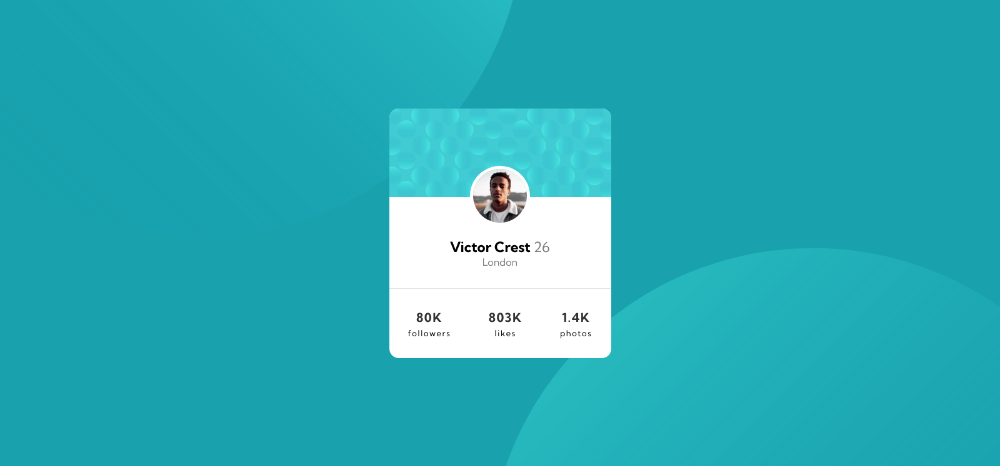
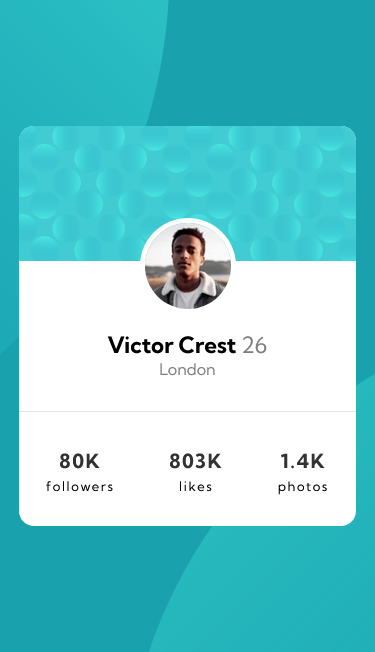

# Frontend Mentor - Profile card component solution

This is a solution to the [Profile card component challenge on Frontend Mentor](https://www.frontendmentor.io/challenges/profile-card-component-cfArpWshJ). Frontend Mentor challenges help you improve your coding skills by building realistic projects.

## Table of contents

- [Overview](#overview)
  - [The challenge](#the-challenge)
  - [Screenshot](#screenshot)
  - [Links](#links)
- [My process](#my-process)
  - [Built with](#built-with)
  - [What I learned](#what-i-learned)
- [Author](#author)

## Overview

### The challenge

- Build out the project to the designs provided

### Screenshot




### Links

- Live Site URL: [Add live site URL here](https://your-live-site-url.com)

## My process

### Built with

- Semantic HTML5 markup
- Flexbox

### What I learned

I'd seen the position property in my course and I put it in this project. I think I learned how to use it :)

```css
.proud-of-this-css {
  position:absolute;
  position:relative;
}

## Author

- Frontend Mentor - [@thirraz](https://www.frontendmentor.io/profile/thirraz)
- Twitter - [@thirrazgo](https://www.twitter.com/thirrazgo)
```
